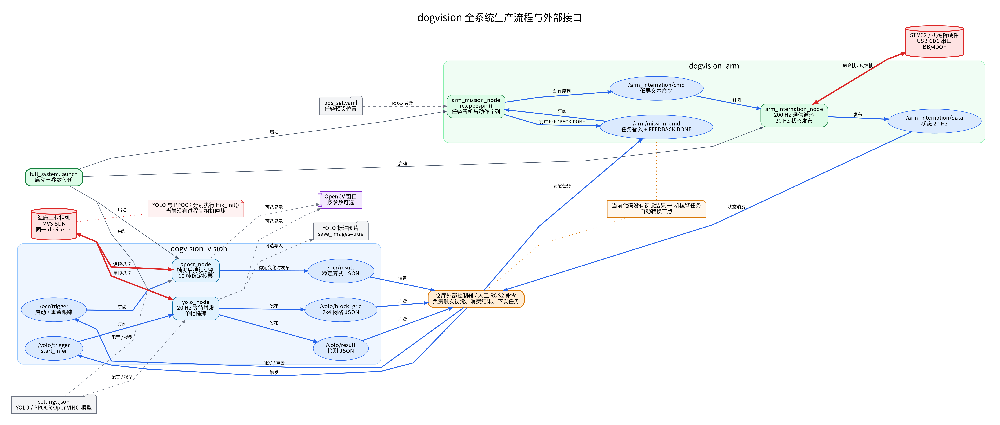
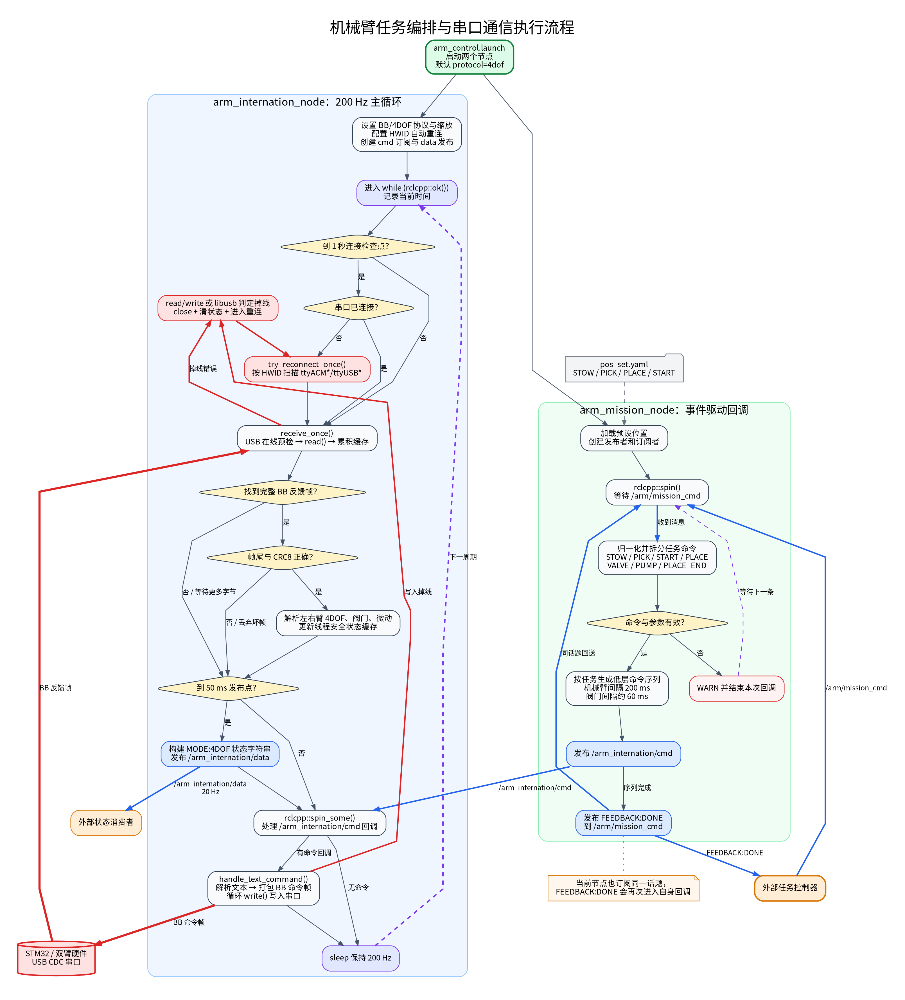
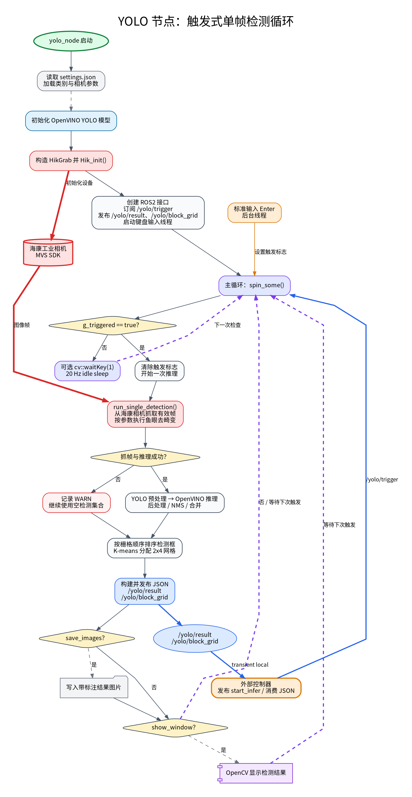
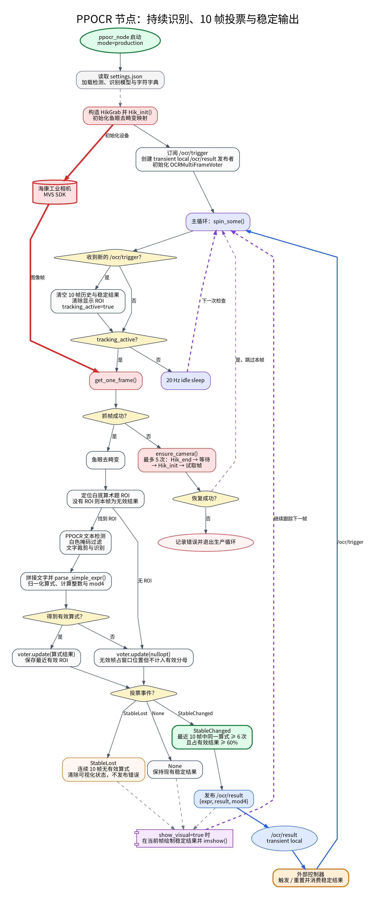

# 程序执行流程图

本目录描述 `dogvision_bringup/full_system.launch` 启动的生产系统执行流程。
图中内容严格对应当前代码，不包含尚未实现的视觉到机械臂自动决策逻辑。

## 图表索引

### 1. 全系统接口总览

[查看 PNG](01_system_overview.png) | [查看 DOT 源码](01_system_overview.dot)



### 2. 机械臂任务与串口循环

[查看 PNG](02_arm_execution.png) | [查看 DOT 源码](02_arm_execution.dot)



### 3. YOLO 单帧触发循环

[查看 PNG](03_yolo_execution.png) | [查看 DOT 源码](03_yolo_execution.dot)



### 4. PPOCR 持续识别与投票循环

[查看 PNG](04_ocr_execution.png) | [查看 DOT 源码](04_ocr_execution.dot)



## 外部接口

| 类型 | 接口 | 当前行为 |
|---|---|---|
| ROS2 | `/arm/mission_cmd` | 外部任务输入；任务节点也向同一话题发布 `FEEDBACK:DONE` |
| ROS2 | `/arm_internation/cmd` | 任务节点发布的低层文本命令 |
| ROS2 | `/arm_internation/data` | 机械臂与传感器状态，20 Hz |
| ROS2 | `/yolo/trigger` | 收到 `start_infer` 后执行一次单帧推理 |
| ROS2 | `/yolo/result` | YOLO 检测 JSON，transient local |
| ROS2 | `/yolo/block_grid` | 2x4 网格 JSON，transient local |
| ROS2 | `/ocr/trigger` | 启动或重置 OCR 持续跟踪 |
| ROS2 | `/ocr/result` | 稳定算式 JSON，transient local |
| 硬件 | 海康工业相机 / MVS SDK | YOLO 与 PPOCR 当前分别初始化并访问同一设备 |
| 硬件 | STM32 USB CDC 串口 | BB/4DOF 命令下发、反馈帧接收、CRC8 校验与自动重连 |
| 文件 | `settings.json` 与 OpenVINO 模型 | YOLO、PPOCR 初始化输入 |
| 文件 | `pos_set.yaml` | 机械臂任务预设位置 |
| 输出 | YOLO 标注图片 | `save_images=true` 时写入配置目录 |
| 输出 | OpenCV 窗口 | YOLO/OCR 对应显示参数启用时显示 |

## 图例

- 蓝色实线：ROS2 话题数据流。
- 红色粗线：相机、USB 串口等硬件 I/O。
- 灰色虚线：配置、模型、文件或窗口输出。
- 紫色虚线：程序循环回边。
- 橙色节点：仓库外部的控制器、人工命令或消费者。

当前仓库没有把 `/yolo/result`、`/yolo/block_grid` 或 `/ocr/result`
自动转换为 `/arm/mission_cmd` 的节点。总览图中的外部控制器用于表示这一
仓库外衔接点，不表示已有实现。

## 重新渲染

系统需安装 Graphviz：

```bash
cd docs/program_execution_flow
./render.sh
```

脚本使用 `dot -Tpng` 和 `Noto Sans CJK SC` 字体生成高分辨率 PNG。
